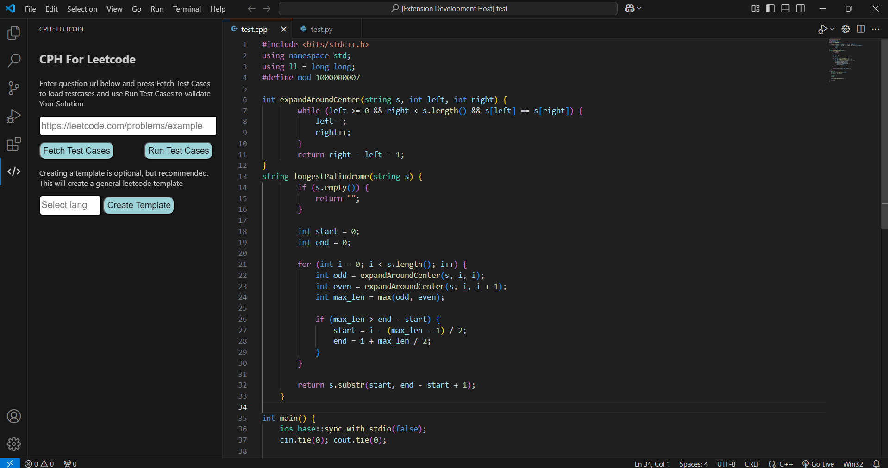

# CPH For Leetcode.

A Visual Studio Code extension designed to streamline your Leetcode practice. This Extension integrates sleamlessly with VS Code Environment 
and provides a user-friendly UI to `fetch` and `run` Leetcode problem test cases with just using problem `url` , allowing you to solve LeetCode problems efficiently in your preferred coding environment.

## Features.
* Easy Fetching and Running of Test Cases.
* No need to add any extra code to your solution.
* User Friendly UI.
* Clearly SHowing Error messages, Test Verdicts.

## Requirements.

* VS Code
* G++ Compiler (to run solution written in C++)
* Python
* Node.js
* npm

## Installation / Usage Guide.

* The Extension is not yet available on VS Code marketplace. So to test the extension follow follwoing steps.
* Clone the Repo.
* Open the directory
* Execute command `npm install` in CLI.
* Open `extension.js` and press `F5` to open debug window where the extension becomes activated.
* To use through UI, just paste the `question link` and and press `Fetch Test Cases` to fetch test cases and to run press `Run Test Cases`.
* To use through Vs Code command, press `ctrl + shift + p` and run `Fetch Test Cases`, it will open a input window to url after press `enter` to fetch test cases. And to run test cases press `ctrl + shift + p` and run `Run Test Cases`.

## General Instruction for user
* Code file must be open for running the code.
* The inputs must be taken in the order given leetcode.
* Output must be stdout to terminal each element separated by new line or space.

  
## Known Issues.

* The test result validating will might be fail for problems having multiple solutions.

## Future Devlopments.
* Add Feature for automatic code template generation for user so that they just have to complete a function like in Leetcode.
* Add Dynamic Test Case addition and deletion.

## Screenshots

## THANKS!!!

---

